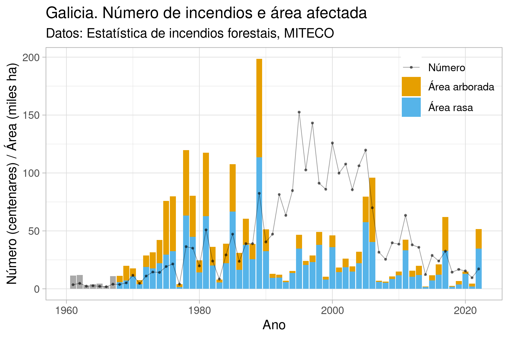

### Serie temporal do número de incendios forestais e área afectada en España e Galicia, 1961-2022

Datos orixinais: [Estadística de Incendios Forestales](https://www.miteco.gob.es/es/biodiversidad/temas/incendios-forestales/estadisticas-incendios.html), Ministerio para la Transición Ecológica y el Reto Demográfico

